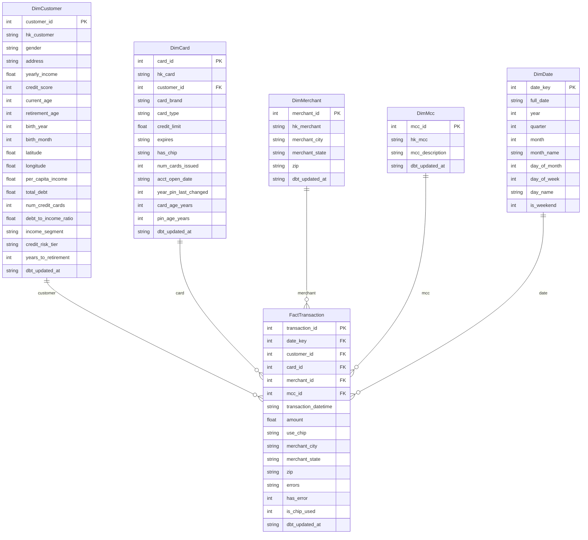

# Gold Layer — ER Diagram

```mermaid
erDiagram
    DimCustomer {
        int customer_id PK
        string hk_customer
        string gender
        string address
        float yearly_income
        int credit_score
        int current_age
        int retirement_age
        int birth_year
        int birth_month
        float latitude
        float longitude
        float per_capita_income
        float total_debt
        int num_credit_cards
        float debt_to_income_ratio
        string income_segment
        string credit_risk_tier
        int years_to_retirement
        string dbt_updated_at
    }

    DimCard {
        int card_id PK
        string hk_card
        int customer_id FK
        string card_brand
        string card_type
        float credit_limit
        string expires
        string has_chip
        int num_cards_issued
        string acct_open_date
        int year_pin_last_changed
        int card_age_years
        int pin_age_years
        string dbt_updated_at
    }

    DimMerchant {
        int merchant_id PK
        string hk_merchant
        string merchant_city
        string merchant_state
        string zip
        string dbt_updated_at
    }

    DimMcc {
        int mcc_id PK
        string hk_mcc
        string mcc_description
        string dbt_updated_at
    }

    DimDate {
        int date_key PK
        string full_date
        int year
        int quarter
        int month
        string month_name
        int day_of_month
        int day_of_week
        string day_name
        int is_weekend
    }

    FactTransaction {
        int transaction_id PK
        int date_key FK
        int customer_id FK
        int card_id FK
        int merchant_id FK
        int mcc_id FK
        string transaction_datetime
        float amount
        string use_chip
        string merchant_city
        string merchant_state
        string zip
        string errors
        int has_error
        int is_chip_used
        string dbt_updated_at
    }

    DimCustomer ||--o{ FactTransaction : customer
    DimCard ||--o{ FactTransaction : card
    DimMerchant ||--o{ FactTransaction : merchant
    DimMcc ||--o{ FactTransaction : mcc
    DimDate ||--o{ FactTransaction : date
```
