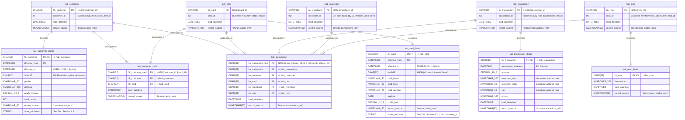

```mermaid
erDiagram
    %% ======================================================
    %% CONCEPTUAL SOURCE GROUPING (Visual Aid)
    %% Note: Records are loaded via 'bronze.{table_name}'
    %% ======================================================

    %% ======================================================
    %% HUB TABLES (Core Business Keys)
    %% Prefix: hub_
    %% Rule: Unique Business Keys, No Updates.
    %% ======================================================
    hub_customer {
        CHAR(32) hk_customer PK "HASH(customer_id)"
        INT customer_id "Business Key from users_mns.id"
        DATETIME2 load_datetime
        NVARCHAR(50) record_source "'bronze.users_mns'"
    }

    hub_card {
        CHAR(32) hk_card PK "HASH(card_id)"
        INT card_id "Business Key from cards_mns.id"
        DATETIME2 load_datetime
        NVARCHAR(50) record_source "'bronze.cards_mns'"
    }

    hub_transaction {
        CHAR(32) hk_transaction PK "HASH(transaction_id)"
        INT transaction_id "Business Key from transactions_mns.id"
        DATETIME2 load_datetime
        NVARCHAR(50) record_source "'bronze.transactions_mns'"
    }

    hub_merchant {
        CHAR(32) hk_merchant PK "HASH(merchant_id)"
        INT merchant_id "BK from trans_tdy (JOIN trans_mns on 'I')"
        DATETIME2 load_datetime
        NVARCHAR(50) record_source "'bronze.transactions_tdy'"
    }

    hub_mcc {
        CHAR(32) hk_mcc PK "HASH(mcc_id)"
        INT mcc_id "Business Key from mcc_codes_mns.mcc_id"
        DATETIME2 load_datetime
        NVARCHAR(50) record_source "'bronze.mcc_codes_mns'"
    }

    %% ======================================================
    %% LINK TABLES (Relationships)
    %% Prefix: link_
    %% Rule: Unique Relationship Keys, No Updates.
    %% ======================================================
    link_customer_card {
        CHAR(32) hk_customer_card PK "HASH(customer_id || card_id)"
        CHAR(32) hk_customer FK "-> hub_customer"
        CHAR(32) hk_card FK "-> hub_card"
        DATETIME2 load_datetime
        NVARCHAR(50) record_source "'bronze.cards_mns'"
    }

    link_transaction {
        CHAR(32) hk_transaction_link PK "HASH(trans_id||cust_id||card_id||merch_id||mcc_id)"
        CHAR(32) hk_transaction FK "-> hub_transaction"
        CHAR(32) hk_customer FK "-> hub_customer"
        CHAR(32) hk_card FK "-> hub_card"
        CHAR(32) hk_merchant FK "-> hub_merchant"
        CHAR(32) hk_mcc FK "-> hub_mcc"
        DATETIME2 load_datetime
        NVARCHAR(50) record_source "'bronze.transactions_tdy'"
    }

    %% ======================================================
    %% SATELLITE TABLES (Context / Descriptives)
    %% Prefix: sat_
    %% Rule: Track History (SCD1/SCD2), Linked to Hub/Link.
    %% ======================================================
    
    %% -- SCD Type 2 Satellites --
    sat_customer_profile {
        CHAR(32) hk_customer PK, FK "-> hub_customer"
        DATETIME2 effective_from PK
        DATETIME2 effective_to "('9999-12-31' = Active)"
        CHAR(32) hashdiff "HASH(all descriptive attributes)"
        NVARCHAR_20 gender
        NVARCHAR_255 address
        DECIMAL_12_2 yearly_income
        INT credit_score
        NVARCHAR_50 record_source "'bronze.users_mns'"
        STRING other_attributes "See Doc Section 4.3"
    }

    sat_card_detail {
        CHAR(32) hk_card PK, FK "-> hub_card"
        DATETIME2 effective_from PK
        DATETIME2 effective_to "('9999-12-31' = Active)"
        CHAR(32) hashdiff "HASH(all descriptive attributes)"
        NVARCHAR_50 card_brand
        NVARCHAR_50 card_type
        NVARCHAR_20 card_number
        DATE expires
        DECIMAL_12_2 credit_limit
        NVARCHAR_50 record_source "'bronze.cards_mns'"
        STRING other_attributes "See Doc Section 4.3, ⚠ No customer_id"
    }

    %% -- SCD Type 1 Satellites --
    sat_transaction_detail {
        CHAR(32) hk_transaction PK, FK "-> hub_transaction"
        DATETIME transaction_datetime "BK Context"
        DECIMAL_10_2 amount
        NVARCHAR_100 merchant_city "Location captured here"
        NVARCHAR_50 merchant_state "Location captured here"
        NVARCHAR_10 zip "Location captured here"
        NVARCHAR_100 errors
        DATETIME2 load_datetime
        NVARCHAR(50) record_source "'bronze.transactions_tdy'"
    }

    sat_mcc_detail {
        CHAR(32) hk_mcc PK, FK "-> hub_mcc"
        NVARCHAR_255 description
        DATETIME2 load_datetime
        NVARCHAR(50) record_source "'bronze.mcc_codes_mns'"
    }

    %% ======================================================
    %% RELATIONSHIPS (DV 2.0 Standard)
    %% Hub ||--|{ Satellite (One-to-Many History)
    %% Hub ||--|{ Link      (Parent-to-Child FK)
    %% ======================================================
    
    %% Relationships for hub_customer
    hub_customer ||--|{ sat_customer_profile : "describes"
    hub_customer ||--|{ link_customer_card : "participates in"
    hub_customer ||--|{ link_transaction : "participates in"

    %% Relationships for hub_card
    hub_card ||--|{ sat_card_detail : "describes"
    hub_card ||--|{ link_customer_card : "participates in"
    hub_card ||--|{ link_transaction : "participates in"

    %% Relationships for hub_transaction
    hub_transaction ||--|{ sat_transaction_detail : "describes"
    hub_transaction ||--|{ link_transaction : "participates in"

    %% Relationships for hub_merchant
    hub_merchant ||--|{ link_transaction : "participates in"

    %% Relationships for hub_mcc
    hub_mcc ||--|{ sat_mcc_detail : "describes"
    hub_mcc ||--|{ link_transaction : "participates in"
```