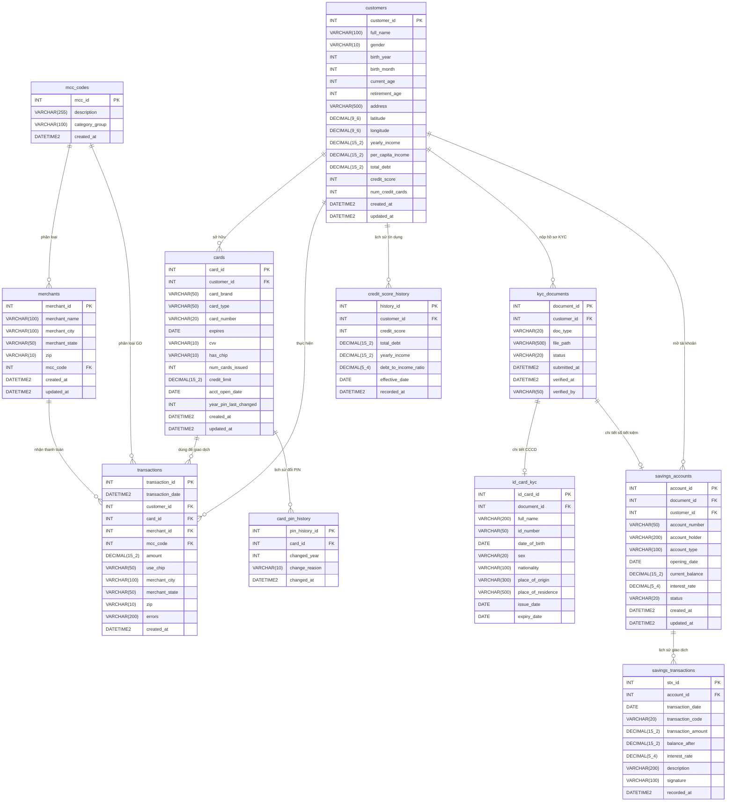

# OLTP Schema – Hệ thống Ngân hàng (Nguồn dữ liệu cho Pipeline)

Đây là schema hệ thống vận hành (OLTP) nguồn, cung cấp dữ liệu cho toàn bộ pipeline:
- **Nhánh Structured**: `customers`, `cards`, `transactions`, `merchants`, `mcc_codes` → Bronze → Silver (Data Vault) → Gold (Star Schema)
- **Nhánh Unstructured**: `kyc_documents` → OCR Pipeline → `bronze.id_card_results` / `bronze.savings_book_results`

---

## ERD (Entity Relationship Diagram)



---

## Ánh xạ OLTP → Pipeline

| Bảng OLTP | Luồng dữ liệu | Đích cuối (Gold) |
|---|---|---|
| `customers` | → `bronze.users_tdy/pdy` → Silver Hub/Sat → | `dim_customer` |
| `cards` | → `bronze.cards_tdy/pdy` → Silver Hub/Sat → | `dim_card` |
| `transactions` | → `bronze.transactions_tdy/pdy` → Silver Link/Sat → | `fact_transaction` |
| `merchants` | → `bronze.transactions_*` (denorm) → Silver → | `dim_merchant` |
| `mcc_codes` | → `bronze.mcc_codes_tdy/pdy` → Silver → | `dim_mcc` |
| `kyc_documents` + `id_card_kyc` | → **OCR Pipeline** → `bronze.id_card_results` | (KYC layer) |
| `kyc_documents` + `savings_accounts` | → **OCR Pipeline** → `bronze.savings_book_results` | (KYC layer) |

---

## Cơ chế đồng bộ (MNS Pattern)

```
OLTP Source ──daily snapshot──► bronze.*_tdy   (today)
                                bronze.*_pdy   (yesterday)
                                     │
                              MNS comparison
                              (I / U / D flags)
                                     │
                              ► Silver Data Vault
                                  hub_*  (business keys)
                                  sat_*  (attributes + SCD2)
                                  lnk_*  (relationships)
                                     │
                              ► Gold Star Schema
                                  dim_* / fact_*
```
