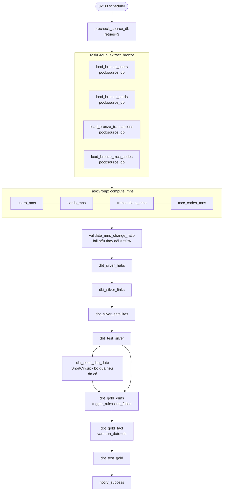
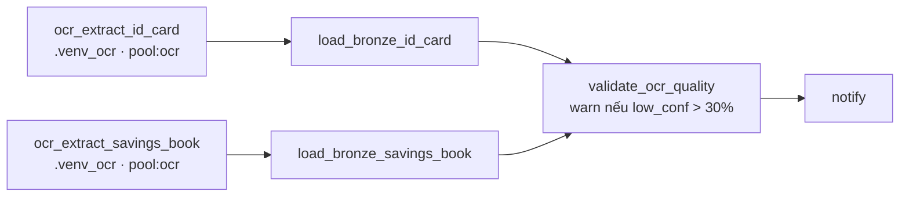
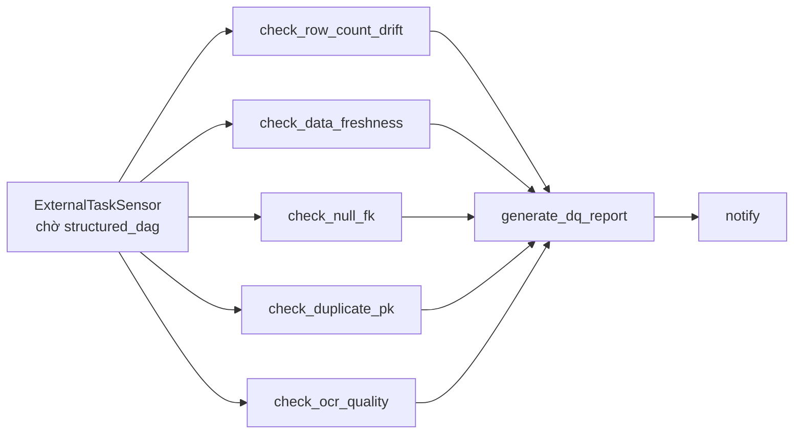

# Operation System — Banking Pipeline

> Tài liệu duy nhất về cách hệ thống Airflow vận hành, quy trình setup, kiểm soát lỗi và
> truy vết log cho dự án DATN.  
> Môi trường: **Windows 11 · PowerShell · Docker Desktop · SQL Server**.

---

## Mục lục

1. [Kiến trúc tổng quan](#1-kiến-trúc-tổng-quan)
2. [Cách Airflow vận hành trong dự án này](#2-cách-airflow-vận-hành-trong-dự-án-này)
3. [Audit table — nguồn sự thật tập trung](#3-audit-table--nguồn-sự-thật-tập-trung)
4. [Logging — nơi tìm log](#4-logging--nơi-tìm-log)
5. [Setup từ đầu — từng bước](#5-setup-từ-đầu--từng-bước)
6. [Chi tiết 3 DAG](#6-chi-tiết-3-dag)
7. [4 tầng phòng thủ lỗi](#7-4-tầng-phòng-thủ-lỗi)
8. [Runbook — xử lý 8 lỗi thường gặp](#8-runbook--xử-lý-8-lỗi-thường-gặp)
9. [Monitoring & Alerting](#9-monitoring--alerting)
10. [Backfill & Recovery](#10-backfill--recovery)
11. [Daily checklist](#11-daily-checklist)
12. [Tham chiếu nhanh — CLI & SQL](#12-tham-chiếu-nhanh--cli--sql)

---

## 1. Kiến trúc tổng quan

```
SQL Server (source)
        │  extract hàng ngày
        ▼
┌─────────────────────────────────────┐
│  BRONZE  — TDY / PDY / MNS          │  scripts/extract/*.py
│  (staging + change-set I/U/D)       │
└──────────────┬──────────────────────┘
               │ dbt run tag:hub/link/satellite
               ▼
┌─────────────────────────────────────┐
│  SILVER  — Data Vault               │  dbt_bank/models/silver/
│  (hub · link · satellite)           │
└──────────────┬──────────────────────┘
               │ dbt run tag:dim / fact_transaction
               ▼
┌─────────────────────────────────────┐
│  GOLD  — Star Schema                │  dbt_bank/models/gold/
│  (dim_* · fact_transaction)         │
└──────────────┬──────────────────────┘
               │
     ┌─────────┴─────────┐
     ▼                   ▼
Power BI             Chatbot (text-to-SQL)
```

**Pipeline song song — OCR (unstructured):**

```
Ảnh (CCCD · Sổ tiết kiệm)
        │ PaddleOCR (.venv_ocr)
        ▼
bronze.id_card_results
bronze.savings_book_results
        │ query trực tiếp
        ▼
Direct SQL / Analytics
```

---

## 2. Cách Airflow vận hành trong dự án này

### 2.1. 3 DAG và mối liên hệ

```
02:00  banking_structured_dag  ──────────────────────────────────────┐
                                                                      │ ExternalTaskSensor
04:00  data_quality_dag  ◄─────── chờ structured_dag xong ───────────┘

manual ocr_unstructured_dag    ──── trigger khi có batch ảnh mới
```

| DAG | Schedule | Mục đích |
|-----|----------|----------|
| `banking_structured_dag` | `0 2 * * *` | ETL chính Bronze → Silver → Gold |
| `data_quality_dag` | `0 4 * * *` | DQ checks sau khi structured DAG xong |
| `ocr_unstructured_dag` | `None` (manual) | OCR CCCD + Sổ tiết kiệm → Bronze |

### 2.2. Cấu trúc thư mục DAG

```
dags/
├── banking_structured_dag.py   # DAG chính
├── ocr_unstructured_dag.py     # DAG OCR
├── data_quality_dag.py         # DAG DQ
└── common/
    ├── constants.py            # DEFAULT_ARGS, paths, pools, SCRIPT_ENV
    ├── callbacks.py            # slack_alert, slack_retry_notice
    └── operators.py            # AuditedBashOperator, AuditedPythonOperator
```

### 2.3. Cơ chế Audit — mọi task đều tự ghi log vào DB

Mỗi `AuditedBashOperator` / `AuditedPythonOperator` **tự động**:

1. **Trước khi chạy** → INSERT 1 row `status='started'` vào `audit.pipeline_run_log`
2. **Thành công** → UPDATE `status='success'`, `ended_at`, `duration_sec`
3. **Thất bại** → UPDATE `status='failed'`, ghi đầy đủ traceback vào `error_message`

Airflow cũng truyền xuống script Python 4 env vars:

```
AIRFLOW_RUN_DATE   = {{ ds }}              # ngày execution YYYY-MM-DD
AIRFLOW_TRY_NUMBER = {{ task_instance.try_number }}
AIRFLOW_LOG_PATH   = {{ ti.log_filepath }}
AIRFLOW_LOG_URL    = {{ ti.log_url }}
```

Nhờ đó script Python tự ghi đúng `attempt`, `log_file_path`, `airflow_log_url` vào audit row.

### 2.4. Pools — giới hạn concurrency

| Pool | Slots | Tác dụng |
|------|-------|----------|
| `source_db_pool` | 2 | Tối đa 2 extract task chạy song song → tránh quá tải source DB |
| `dbt_pool` | 4 | Tối đa 4 dbt run/test song song |
| `ocr_pool` | 1 | OCR CPU-bound — không song song được |

---

## 3. Audit table — nguồn sự thật tập trung

### 3.1. Schema

```sql
-- Tạo bằng: python scripts/setup_audit.py
CREATE TABLE audit.pipeline_run_log (
    run_log_id      BIGINT IDENTITY(1,1) PRIMARY KEY,
    dag_id          NVARCHAR(100)   NOT NULL,
    task_id         NVARCHAR(100)   NOT NULL,
    run_date        DATE            NOT NULL,
    attempt         INT             NOT NULL DEFAULT 1,
    status          NVARCHAR(20)    NOT NULL,   -- started / success / failed / skipped
    started_at      DATETIME2       NOT NULL DEFAULT SYSUTCDATETIME(),
    ended_at        DATETIME2       NULL,
    duration_sec    AS DATEDIFF(SECOND, started_at, ended_at) PERSISTED,
    rows_processed  BIGINT          NULL,
    rows_inserted   BIGINT          NULL,
    rows_updated    BIGINT          NULL,
    rows_deleted    BIGINT          NULL,
    error_message   NVARCHAR(MAX)   NULL,       -- full traceback khi fail
    log_file_path   NVARCHAR(500)   NULL,
    airflow_log_url NVARCHAR(500)   NULL,
    extra_metadata  NVARCHAR(MAX)   NULL,       -- JSON freeform
    host_name       NVARCHAR(100)   NULL
);
```

2 views đi kèm:
- `audit.v_latest_run_per_task` — trạng thái mới nhất của mỗi task
- `audit.v_task_success_rate_30d` — success rate 30 ngày theo task

### 3.2. Query audit thường dùng

```sql
-- Trạng thái DAG hôm nay (dùng để watch live)
SELECT task_id, status, duration_sec, rows_inserted, LEFT(error_message,200) AS err
FROM audit.pipeline_run_log
WHERE dag_id = 'banking_structured_dag'
  AND run_date = CAST(GETDATE() AS DATE)
ORDER BY started_at;

-- Tất cả task fail trong 7 ngày
SELECT run_date, task_id, attempt, LEFT(error_message,300) AS err, log_file_path
FROM audit.pipeline_run_log
WHERE status = 'failed' AND run_date >= DATEADD(DAY,-7,GETDATE())
ORDER BY started_at DESC;

-- Task chạy chậm > 1.5x baseline (phát hiện sớm vấn đề)
WITH baseline AS (
    SELECT task_id, AVG(CAST(duration_sec AS BIGINT)) AS avg_sec
    FROM audit.pipeline_run_log
    WHERE status='success' AND run_date >= DATEADD(DAY,-30,GETDATE())
    GROUP BY task_id
)
SELECT l.run_date, l.task_id, l.duration_sec, b.avg_sec,
       CAST(l.duration_sec*100.0/NULLIF(b.avg_sec,0) AS INT) AS pct_of_baseline
FROM audit.pipeline_run_log l
JOIN baseline b ON l.task_id = b.task_id
WHERE l.status='success'
  AND l.run_date = CAST(GETDATE() AS DATE)
  AND l.duration_sec > b.avg_sec * 1.5
ORDER BY pct_of_baseline DESC;

-- Success rate per task (30 ngày)
SELECT * FROM audit.v_task_success_rate_30d
WHERE dag_id = 'banking_structured_dag'
ORDER BY success_rate_pct ASC;
```

---

## 4. Logging — nơi tìm log

### 4.1. Cấu trúc thư mục

```
logs/
├── airflow/                          ← Airflow standard (Airflow UI link đến đây)
│   └── dag_id={dag}/run_id={date}/
│       └── task_id={task}/attempt={n}.log
│
├── scripts/                          ← log Python scripts (custom)
│   ├── load_bronze_users/
│   │   └── 2026-05-25.log
│   └── users_mns/
│       └── 2026-05-25.log
│
├── dbt/                              ← log dbt
│   └── 2026-05-25/
│       ├── dbt.log
│       └── run_results.json          ← dbt artifact per-model
│
└── ocr/                              ← PaddleOCR raw output
    └── 2026-05-25/
```

Format log mỗi dòng:
```
2026-05-25 02:15:33 [INFO] [datn.load_bronze_users] [PID=1234] Read 2031 rows from source
```

### 4.2. Tra log nhanh

| Tình huống | Lệnh |
|-----------|------|
| Xem live log task đang chạy | `docker compose exec airflow-scheduler tail -f /opt/airflow/logs/scripts/load_bronze_users/2026-05-25.log` |
| Tìm tất cả ERROR hôm nay | `docker compose exec airflow-scheduler grep -rn "ERROR\|Traceback" /opt/airflow/logs/scripts/*/2026-05-25.log` |
| Xem log Airflow task trên UI | Airflow UI → click task → tab **Log** |
| Xem dbt model nào fail | `docker compose exec airflow-scheduler bash -c "cat /opt/airflow/dbt_bank/target/run_results.json \| python3 -c \"import json,sys; [print(r['unique_id'],r['status']) for r in json.load(sys.stdin)['results'] if r['status']!='success'\""` |
| Full audit một task | `SELECT * FROM audit.pipeline_run_log WHERE dag_id='...' AND task_id='...' AND run_date='...' ORDER BY started_at DESC` |

### 4.3. Retention policy

| Log | Giữ bao lâu | Cleanup |
|-----|-------------|---------|
| `logs/airflow/` | 14 ngày | `AIRFLOW__LOGGING__LOG_RETENTION_DAYS=14` trong docker-compose |
| `logs/scripts/` | 30 ngày | `find /opt/airflow/logs/scripts -mtime +30 -delete` |
| `logs/dbt/` | 30 ngày | `find /opt/airflow/logs/dbt -mtime +30 -delete` |
| `audit.pipeline_run_log` | 365 ngày | Định kỳ archive rows cũ |

---

## 5. Setup từ đầu — từng bước

> Chạy tất cả lệnh trong PowerShell tại `e:\project\DATN`.

---

### Phase 0 — Kiểm tra prerequisites

```powershell
# Python >= 3.11
python --version

# Docker Desktop đang chạy
docker --version
docker ps

# SQL Server truy cập được (đổi thông tin cho đúng môi trường)
sqlcmd -S localhost -U sa -Q "SELECT @@VERSION"

# File .env đã có
Get-Content .env | Select-String "SOURCE_SERVER|TARGET_SERVER"

# ODBC Driver 17
Get-OdbcDriver -Name "*SQL Server*"
```

**Nếu thiếu:**
- Docker chưa chạy → mở Docker Desktop, đợi icon xanh
- `.env` chưa có → `Copy-Item .env.example .env` rồi sửa thông tin DB
- ODBC Driver 17 chưa cài → tải tại microsoft.com/en-us/download/details.aspx?id=56567
- SQL Server trên Windows host → trong `.env` dùng `TARGET_SERVER=host.docker.internal` (không phải `localhost`) để container Docker truy cập được

---

### Phase 1 — Tạo schema audit

```powershell
# Tạo và kích hoạt virtual env
python -m venv .venv
.venv\Scripts\Activate.ps1
pip install -r requirements.txt

# Tạo audit.pipeline_run_log + 2 views
python scripts/setup_audit.py
```

**Output mong đợi:**
```
Running 6 batches from create_audit_tables.sql...
Done. audit.pipeline_run_log + views created.
```

**Verify:**
```powershell
sqlcmd -S localhost -d bank_dwh -U sa -Q `
    "SELECT name FROM sys.views WHERE schema_id = SCHEMA_ID('audit')"
# Phải thấy: v_latest_run_per_task, v_task_success_rate_30d
```

---

### Phase 2 — Build & khởi động Airflow

```powershell
# Bước 1: Build image (lần đầu mất 5-10 phút)
docker compose build

# Bước 2: Init metastore + tạo admin user
docker compose up airflow-init
# Đợi thấy: "Airflow init done." và "exited with code 0"

# Bước 3: Khởi động webserver + scheduler
docker compose up -d airflow-webserver airflow-scheduler

# Bước 4: Verify
docker compose ps
# Phải thấy 3 containers: postgres (healthy), airflow-webserver (healthy), airflow-scheduler
```

**Mở UI:**
```powershell
Start-Process "http://localhost:8080"
# Login: admin / admin
```

**Nếu DAG không hiện:**
```powershell
docker compose logs airflow-scheduler --tail 50 | Select-String "ERROR|ImportError"
# Lỗi common:
#   ModuleNotFoundError: scripts.utils  → check volume mount
#   ImportError: common.constants       → docker compose restart airflow-scheduler
```

---

### Phase 3 — Cấu hình Airflow (connections, variables, pools)

```powershell
# ── Connections ──────────────────────────────────────────────────────
# SQL Server source (đổi <> cho đúng)
docker compose exec airflow-scheduler airflow connections add sql_source `
    --conn-type mssql `
    --conn-host "<SOURCE_SERVER>" `
    --conn-port 1433 `
    --conn-schema "<SOURCE_DATABASE>" `
    --conn-login "<SOURCE_USERNAME>" `
    --conn-password "<SOURCE_PASSWORD>"

# SQL Server target / warehouse
docker compose exec airflow-scheduler airflow connections add sql_target `
    --conn-type mssql `
    --conn-host "<TARGET_SERVER>" `
    --conn-port 1433 `
    --conn-schema "<TARGET_DATABASE>" `
    --conn-login "<TARGET_USERNAME>" `
    --conn-password "<TARGET_PASSWORD>"

# Slack webhook (tùy chọn — bỏ qua nếu chưa có)
docker compose exec airflow-scheduler airflow connections add slack_alert `
    --conn-type http `
    --conn-host "https://hooks.slack.com" `
    --conn-password "/services/T01XXX/B01YYY/zzzzz"

# Verify
docker compose exec airflow-scheduler airflow connections list

# ── Variables ─────────────────────────────────────────────────────────
docker compose exec airflow-scheduler airflow variables set skip_mns_validation false
docker compose exec airflow-scheduler airflow variables set ocr_conf_threshold 0.5
docker compose exec airflow-scheduler airflow variables set freshness_max_hours 24
docker compose exec airflow-scheduler airflow variables set row_count_drift_pct 20

# Verify
docker compose exec airflow-scheduler airflow variables list

# ── Pools ─────────────────────────────────────────────────────────────
docker compose exec airflow-scheduler airflow pools set source_db_pool 2 "Source DB extract"
docker compose exec airflow-scheduler airflow pools set dbt_pool 4 "dbt run/test"
docker compose exec airflow-scheduler airflow pools set ocr_pool 1 "OCR CPU-bound"

# Verify
docker compose exec airflow-scheduler airflow pools list
```

---

### Phase 4 — Verify dbt

```powershell
# Cần có profiles.yml (copy từ example rồi sửa thông tin DB)
Copy-Item dbt_bank\profiles.yml.example dbt_bank\profiles.yml
# Sửa TARGET_SERVER, database, user, password trong profiles.yml

# Test kết nối dbt
docker compose exec airflow-scheduler bash -c `
    "cd /opt/airflow/dbt_bank && dbt debug --profiles-dir /opt/airflow/dbt_bank"
# Phải thấy: "Connection test: [OK connection ok]"

# Cài dbt packages (1 lần)
docker compose exec airflow-scheduler bash -c `
    "cd /opt/airflow/dbt_bank && dbt deps"

# Seed dim_date (1 lần — 1035 ngày từ 2022-01-01 đến 2024-10-31)
docker compose exec airflow-scheduler bash -c `
    "cd /opt/airflow/dbt_bank && dbt seed --select dim_date"

# Verify
sqlcmd -S localhost -d bank_dwh -U sa -Q "SELECT COUNT(*) FROM gold.dim_date"
# Phải trả về: 1035
```

---

### Phase 5 — First run (chạy thử)

```powershell
# Bước 1: Test 1 task trước (không ảnh hưởng dữ liệu)
docker compose exec airflow-scheduler airflow tasks test `
    banking_structured_dag precheck_source_db 2026-05-29
# Phải thấy: "[precheck] source DB OK: db=... user=..."

# Bước 2: Trigger full DAG
docker compose exec airflow-scheduler airflow dags trigger banking_structured_dag

# Bước 3: Theo dõi qua UI
#   http://localhost:8080 → banking_structured_dag → tab Grid

# Bước 4: Theo dõi qua audit (mở PowerShell window mới)
while ($true) {
    Clear-Host
    sqlcmd -S localhost -d bank_dwh -U sa -Q `
        "SELECT task_id, status, duration_sec, rows_inserted `
         FROM audit.pipeline_run_log `
         WHERE dag_id='banking_structured_dag' AND run_date=CAST(GETDATE() AS DATE) `
         ORDER BY started_at"
    Start-Sleep -Seconds 5
}

# Bước 5: Verify kết quả (~45 phút sau)
sqlcmd -S localhost -d bank_dwh -U sa -Q `
    "SELECT 'dim_customer' t, COUNT(*) n FROM gold.dim_customer UNION ALL
     SELECT 'dim_card',        COUNT(*) FROM gold.dim_card         UNION ALL
     SELECT 'dim_merchant',    COUNT(*) FROM gold.dim_merchant     UNION ALL
     SELECT 'dim_mcc',         COUNT(*) FROM gold.dim_mcc          UNION ALL
     SELECT 'dim_date',        COUNT(*) FROM gold.dim_date         UNION ALL
     SELECT 'fact_transaction',COUNT(*) FROM gold.fact_transaction"

sqlcmd -S localhost -d bank_dwh -U sa -Q `
    "SELECT status, COUNT(*) n FROM audit.pipeline_run_log `
     WHERE run_date=CAST(GETDATE() AS DATE) GROUP BY status"
# Phải thấy: tất cả status='success'
```

---

### Phase 6 — Backfill lịch sử (tùy chọn)

Chỉ chạy nếu muốn nạp dữ liệu từ 2022-01-01 → 2024-10-31.

```powershell
# Tăng max_active_runs tạm thời (sửa trong banking_structured_dag.py dòng max_active_runs=4)
docker compose restart airflow-scheduler

# Chạy backfill (~vài giờ)
docker compose exec airflow-scheduler airflow dags backfill `
    banking_structured_dag `
    --start-date 2022-01-01 `
    --end-date   2024-10-31 `
    --reset-dagruns `
    --rerun-failed-tasks

# Theo dõi tiến độ
sqlcmd -S localhost -d bank_dwh -U sa -Q `
    "SELECT run_date, `
            SUM(CASE WHEN status='success' THEN 1 ELSE 0 END) ok, `
            SUM(CASE WHEN status='failed'  THEN 1 ELSE 0 END) failed `
     FROM audit.pipeline_run_log `
     WHERE dag_id='banking_structured_dag' `
     GROUP BY run_date ORDER BY run_date DESC"

# Sau khi xong → đưa max_active_runs về 1 và restart scheduler
```

---

### Phase 7 — Bật production scheduler

```powershell
# Unpause DAG chính (02:00 daily)
docker compose exec airflow-scheduler airflow dags unpause banking_structured_dag

# Unpause DQ DAG (04:00 daily)
docker compose exec airflow-scheduler airflow dags unpause data_quality_dag

# OCR DAG chỉ unpause khi có nguồn ảnh thường xuyên
# docker compose exec airflow-scheduler airflow dags unpause ocr_unstructured_dag

# Verify lịch chạy tiếp theo
docker compose exec airflow-scheduler airflow dags list-runs `
    -d banking_structured_dag --no-backfill
```

### Checklist deploy thành công

- [ ] `docker compose ps` thấy 3 containers healthy
- [ ] UI `http://localhost:8080` mở được, login OK
- [ ] 3 DAGs hiện trong UI, không có import error
- [ ] 3 connections + 4 variables + 3 pools đã tạo
- [ ] `dbt debug` chạy OK trong container
- [ ] `gold.dim_date` có 1035 rows
- [ ] First run `banking_structured_dag` chạy xong OK
- [ ] `audit.pipeline_run_log` có rows `status='success'`
- [ ] DAGs đã unpause cho production

---

## 6. Chi tiết 3 DAG

### 6.1. `banking_structured_dag` — Task graph



**Bảng task:**

| Task | Retries | Timeout | Pool |
|------|---------|---------|------|
| `precheck_source_db` | 3 | 2 min | — |
| `load_bronze_{entity}` × 4 | 2 (exp. backoff) | 5-30 min | `source_db_pool` |
| `{entity}_mns` × 4 | 1 | 5-20 min | — |
| `validate_mns_change_ratio` | 0 | 2 min | — |
| `dbt_silver_hubs/links/satellites` | 1 | 10-20 min | `dbt_pool` |
| `dbt_test_silver` | 0 | 10 min | `dbt_pool` |
| `dbt_seed_dim_date` | 0 (ShortCircuit) | 2 min | `dbt_pool` |
| `dbt_gold_dims` | 1 | 15 min | `dbt_pool` |
| `dbt_gold_fact` | 2 | 30 min | `dbt_pool` |
| `dbt_test_gold` | 0 | 10 min | `dbt_pool` |

`dbt_gold_fact` nhận `run_date` qua:
```bash
dbt run --select fact_transaction --vars '{"run_date":"{{ ds }}"}'
```
→ `delete+insert` chỉ xử lý đúng 1 ngày → retry an toàn, không tạo duplicate.

### 6.2. `ocr_unstructured_dag` — Task graph



Đặc thù: OCR chạy trong `.venv_ocr` (PaddleOCR), load DB chạy trong `.venv` chính.  
`validate_ocr_quality` chỉ **warn**, không fail DAG — Bronze vẫn lưu raw để debug.

### 6.3. `data_quality_dag` — Task graph



| Check | Threshold | Mức độ |
|-------|-----------|--------|
| Row count drift vs 7d avg | > 20% | Warn |
| Freshness `fact_transaction` | > 24h | Critical |
| Null FK (customer/card/merchant/mcc/date) | > 0 | Warn |
| Duplicate `transaction_id` | > 0 | Critical |
| OCR avg confidence | < 0.7 | Warn |

---

## 7. 4 tầng phòng thủ lỗi

```
┌──────────────────────────────────────────────────────┐
│ Lớp 4 — Slack/Email alert                            │ → báo người xử lý
├──────────────────────────────────────────────────────┤
│ Lớp 3 — Airflow retry (exp. backoff 5→10→20 phút)    │ → tự phục hồi
├──────────────────────────────────────────────────────┤
│ Lớp 2 — try/except + audit_logger trong script       │ → ghi nguyên nhân vào DB
├──────────────────────────────────────────────────────┤
│ Lớp 1 — validate_mns_change_ratio + dbt test         │ → chặn dữ liệu bẩn
└──────────────────────────────────────────────────────┘
```

**Lớp 1 — chặn source bị reset:**  
`validate_mns_change_ratio` fail nếu > 50% record thay đổi trong 1 ngày → không cho load Silver/Gold.

**Lớp 2 — ghi nguyên nhân:**  
```python
with audit_run("banking_structured_dag", "load_bronze_users", run_date) as a:
    # nếu raise → audit tự ghi status='failed' + full traceback
    df = extract()
    a["rows_inserted"] = len(df)
```
Nguyên tắc: **không nuốt exception** — log chi tiết rồi raise để Airflow retry.

**Lớp 3 — retry theo task type:**

| Task type | Retries | Lý do |
|-----------|---------|-------|
| Extract source DB | 2 (exp. backoff) | Chờ DB hồi phục |
| Compute MNS | 1 | Fail lần 2 = vấn đề dữ liệu, cần người |
| dbt run | 1 | Lỗi schema thường không tự hết |
| dbt test | 0 | Fail = vi phạm quy tắc DQ — không retry |

**Lớp 4 — Slack alert format:**
```
🚨 banking_structured_dag.dbt_gold_fact FAILED
   Date: 2026-05-25 | Attempt: 3/3 | Duration: 28m
   Error: Error converting data type nvarchar to numeric (8114)

   📋 SELECT * FROM audit.pipeline_run_log WHERE run_log_id=12345
   🔗 http://localhost:8080/log?dag_id=...&task_id=...
```

---

## 8. Runbook — xử lý 8 lỗi thường gặp

### Quy trình chung khi nhận alert

```
1. Đọc Slack alert → lấy run_log_id
2. SELECT * FROM audit.pipeline_run_log WHERE run_log_id = <id>
   → biết: task, attempt, error_message, log_file_path
3. Click airflow_log_url để xem log chi tiết
4. Tra runbook bên dưới theo error type
5. Apply fix → clear task → verify
```

---

#### Lỗi 1 — `pyodbc.OperationalError: Login timeout` (Source DB down)

```powershell
# Verify source DB từ host
sqlcmd -S <SOURCE_SERVER> -U <user> -Q "SELECT 1"

# Sau khi DB up → clear task để rerun
docker compose exec airflow-scheduler airflow tasks clear `
    banking_structured_dag `
    --task-regex "load_bronze_.*" `
    --start-date <YYYY-MM-DD> --end-date <YYYY-MM-DD> --yes
```

---

#### Lỗi 2 — `Error converting data type nvarchar to numeric (8114)` (dbt cast lỗi)

```powershell
# Tìm giá trị xấu
sqlcmd -S localhost -d bank_dwh -U sa -Q `
    "SELECT TOP 20 latitude FROM silver.sat_customer_profile `
     WHERE TRY_CAST(latitude AS DECIMAL(10,6)) IS NULL AND latitude IS NOT NULL"

# Fix: sửa model dùng TRY_CAST thay CAST (đã áp dụng cho dim_customer.latitude)
# Clear + rerun task tương ứng
docker compose exec airflow-scheduler airflow tasks clear `
    banking_structured_dag --task-regex "dbt_gold_dims" `
    --start-date <YYYY-MM-DD> --end-date <YYYY-MM-DD> --yes
```

---

#### Lỗi 3 — `validate_mns_change_ratio: 73% > 50%` (Source bị reset)

**Không tự rerun ngay.** Kiểm tra trước:

```powershell
sqlcmd -S localhost -d bank_dwh -U sa -Q `
    "SELECT (SELECT COUNT(*) FROM bronze.users_tdy) today, `
            (SELECT COUNT(*) FROM bronze.users_pdy) yesterday"
```

Nếu source thực sự reload (xác nhận với data owner):

```powershell
docker compose exec airflow-scheduler airflow variables set skip_mns_validation true

docker compose exec airflow-scheduler airflow tasks clear `
    banking_structured_dag --task-regex ".*" `
    --start-date <YYYY-MM-DD> --end-date <YYYY-MM-DD> --yes

# Sau khi chạy xong
docker compose exec airflow-scheduler airflow variables set skip_mns_validation false
```

---

#### Lỗi 4 — `dbt test fail: not_null_dim_customer_customer_id`

```powershell
sqlcmd -S localhost -d bank_dwh -U sa -Q `
    "SELECT * FROM gold.dim_customer WHERE customer_id IS NULL"

sqlcmd -S localhost -d bank_dwh -U sa -Q `
    "SELECT * FROM silver.hub_customer WHERE customer_id IS NULL"

# Root cause thường ở extract → fix script → rerun từ extract
docker compose exec airflow-scheduler airflow tasks clear `
    banking_structured_dag --task-regex "load_bronze_users" `
    --start-date <YYYY-MM-DD> --end-date <YYYY-MM-DD> --downstream --yes
```

---

#### Lỗi 5 — Task timeout exceeded

```powershell
# Xem baseline duration
sqlcmd -S localhost -d bank_dwh -U sa -Q `
    "SELECT task_id, AVG(duration_sec) avg_sec, MAX(duration_sec) max_sec `
     FROM audit.pipeline_run_log `
     WHERE status='success' AND task_id='<task>' `
       AND run_date >= DATEADD(DAY,-30,GETDATE()) `
     GROUP BY task_id"
```

Nếu data volume tăng → tăng `execution_timeout` trong DAG hoặc chia chunk extract.

---

#### Lỗi 6 — `fact_transaction duplicate transaction_id`

```powershell
# Verify
sqlcmd -S localhost -d bank_dwh -U sa -Q `
    "SELECT transaction_id, COUNT(*) n `
     FROM gold.fact_transaction `
     WHERE date_key = CAST(FORMAT(GETDATE(),'yyyyMMdd') AS INT) `
     GROUP BY transaction_id HAVING COUNT(*) > 1"

# Fix: xóa ngày đó rồi rerun
sqlcmd -S localhost -d bank_dwh -U sa -Q `
    "DELETE FROM gold.fact_transaction WHERE date_key = <YYYYMMDD>"

docker compose exec airflow-scheduler airflow tasks clear `
    banking_structured_dag --task-regex "dbt_gold_fact" `
    --start-date <YYYY-MM-DD> --end-date <YYYY-MM-DD> --yes
```

---

#### Lỗi 7 — OCR `RuntimeError: PIR/oneDNN` (PaddlePaddle version conflict)

```powershell
# Verify version (phải là 3.2.2)
.venv_ocr\Scripts\Activate.ps1
pip show paddlepaddle

# Fix
pip install paddlepaddle==3.2.2 --force-reinstall

docker compose exec airflow-scheduler airflow tasks clear `
    ocr_unstructured_dag --task-regex "ocr_extract_id_card" `
    --start-date <YYYY-MM-DD> --end-date <YYYY-MM-DD> --yes
```

---

#### Lỗi 8 — dbt `Compilation Error: ref('hub_customer') not found`

```powershell
docker compose exec airflow-scheduler bash -c `
    "cd /opt/airflow/dbt_bank && dbt deps && dbt compile"

docker compose exec airflow-scheduler airflow tasks clear `
    banking_structured_dag --task-regex "dbt_silver_hubs" `
    --start-date <YYYY-MM-DD> --end-date <YYYY-MM-DD> --downstream --yes
```

---

## 9. Monitoring & Alerting

### Slack `#data-alerts` levels

| Level | Khi nào | Action |
|-------|---------|--------|
| 🚨 Critical | DAG fail toàn bộ · duplicate PK · freshness > 24h | On-call trong 30 phút |
| ⚠ Warning | Row count drift > 20% · OCR conf < 0.7 · task chậm > 1.5x | Slack only |
| ✓ Info | DAG success | Không gửi — chỉ ghi audit |

### Disaster scenarios

| Sự cố | Tác động | Recovery |
|-------|----------|----------|
| Source DB down 1h | Pipeline retry 2 lần rồi fail | Clear task khi DB up → tự rerun |
| Source DB schema đổi | Extract fail | Sửa SQL trong script · rebuild · clear rerun |
| Bronze TDY bị xóa | Mất 1 ngày extract | Rerun `load_bronze_*` → tự reload từ source |
| Gold fact duplicate | DQ check fail | DELETE ngày đó + rerun `dbt_gold_fact` |
| Airflow DB crash | Mất run history | Restore Postgres từ backup · audit table DB riêng không ảnh hưởng |

---

## 10. Backfill & Recovery

```powershell
# Rerun toàn bộ 1 ngày fail (cascade downstream)
docker compose exec airflow-scheduler airflow tasks clear `
    banking_structured_dag `
    --start-date 2026-05-28 --end-date 2026-05-28 `
    --downstream --yes

# Rerun chỉ 1 task cụ thể
docker compose exec airflow-scheduler airflow tasks clear `
    banking_structured_dag `
    --task-regex "dbt_gold_fact" `
    --start-date 2026-05-28 --end-date 2026-05-28 --yes

# Backfill khoảng ngày
docker compose exec airflow-scheduler airflow dags backfill `
    banking_structured_dag `
    --start-date 2026-05-01 --end-date 2026-05-28 `
    --rerun-failed-tasks
```

---

## 11. Daily checklist

### Buổi sáng (08:30 — 5 phút)

```powershell
# 1. Check status đêm qua
sqlcmd -S localhost -d bank_dwh -U sa -Q `
    "SELECT status, COUNT(*) n FROM audit.pipeline_run_log `
     WHERE run_date = CAST(DATEADD(DAY,-1,GETDATE()) AS DATE) GROUP BY status"

# 2. Tìm task fail
sqlcmd -S localhost -d bank_dwh -U sa -Q `
    "SELECT task_id, attempt, LEFT(error_message,200) err `
     FROM audit.pipeline_run_log `
     WHERE status='failed' AND run_date >= DATEADD(DAY,-2,GETDATE()) `
     ORDER BY started_at DESC"

# 3. Row count fact hôm qua
sqlcmd -S localhost -d bank_dwh -U sa -Q `
    "SELECT date_key, COUNT(*) txn_count FROM gold.fact_transaction `
     WHERE date_key = CAST(FORMAT(DATEADD(DAY,-1,GETDATE()),'yyyyMMdd') AS INT) `
     GROUP BY date_key"
```

### Cuối tuần (30 phút)

```powershell
# Success rate 30 ngày per task
sqlcmd -S localhost -d bank_dwh -U sa -Q `
    "SELECT * FROM audit.v_task_success_rate_30d `
     WHERE dag_id='banking_structured_dag' ORDER BY success_rate_pct ASC"

# Cleanup logs cũ
docker compose exec airflow-scheduler bash -c `
    "find /opt/airflow/logs/scripts -type f -mtime +30 -delete"
docker compose exec airflow-scheduler bash -c `
    "find /opt/airflow/logs/dbt -type d -mtime +30 -exec rm -rf {} +"
```

---

## 12. Tham chiếu nhanh — CLI & SQL

### Docker

```powershell
docker compose build                          # rebuild image
docker compose build --no-cache              # rebuild hoàn toàn
docker compose up -d airflow-webserver airflow-scheduler
docker compose restart airflow-scheduler     # áp dụng thay đổi DAG
docker compose logs -f airflow-scheduler     # xem log realtime
docker compose ps                            # kiểm tra health
docker compose down                          # stop
docker compose down -v                       # stop + xóa Postgres (CẨNTHẬN)
```

### Airflow CLI (chạy qua `docker compose exec airflow-scheduler`)

```powershell
# DAGs
airflow dags trigger banking_structured_dag
airflow dags pause   banking_structured_dag
airflow dags unpause banking_structured_dag
airflow dags list-runs -d banking_structured_dag

# Tasks
airflow tasks test  banking_structured_dag <task_id> <YYYY-MM-DD>   # test local
airflow tasks state banking_structured_dag <task_id> <YYYY-MM-DD>   # xem state
airflow tasks clear banking_structured_dag `
    --task-regex "<pattern>" `
    --start-date <YYYY-MM-DD> --end-date <YYYY-MM-DD> --yes
airflow tasks logs  banking_structured_dag <task_id> <YYYY-MM-DD> --try-number 1

# Config
airflow connections list
airflow variables list
airflow pools list
```

### Troubleshooting nhanh

| Triệu chứng | Nguyên nhân | Fix |
|-------------|-------------|-----|
| Container exit code 1 | Lỗi .env hoặc Postgres | `docker compose logs airflow-init` |
| DAG không hiện trong UI | Import error | `docker compose logs airflow-scheduler \| grep ImportError` |
| `audit.pipeline_run_log` không có row | PYTHONPATH chưa set | Check `PYTHONPATH=/opt/airflow` trong docker-compose.yaml |
| Task fail `Connection refused` | SQL Server không truy cập từ container | Dùng `host.docker.internal` trong `.env` TARGET_SERVER |
| `Profile dbt_bank not found` | Thiếu `profiles.yml` | Copy từ `profiles.yml.example` rồi sửa |
| Slack không gửi | Connection `slack_alert` chưa set | Bỏ qua — alert fail silently, pipeline vẫn chạy |

---

*Pipeline owner: Nguyễn Hồng Nhung — nguyenhongnhungtxa@gmail.com*
